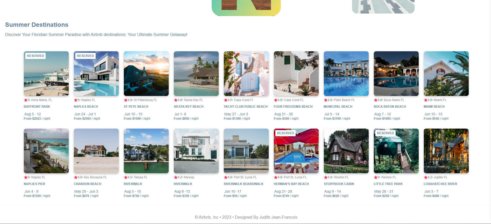

# scrimba-react-airbnb
Created with CodeSandbox

## Table of contents

- [Overview](#overview)
  - [The challenge](#the-challenge)
  - [Screenshot](#screenshot)
  - [Links](#links)
- [My process](#my-process)
  - [Built with](#built-with)
  - [What I learned](#what-i-learned)
  - [Continued development](#continued-development)
  - [Resources](#resources)

## Overview
Created a Airbnb mock webpage with Scrimba

### The challenge

Users should be able to:

- Learn more about the Airbnb summer rentals

### Screenshot

### Links

- Solution URL: https://github.com/Jud1th1/scrimba-react-airbnb
- Live link: https://csb-romcf9.netlify.app/

## My process

-	Watching along with the Scrimba tutorial, I set up a React project in CodeSandBox for an Airbnb clone following along as we the basic project structure and configuration.
-	Component Design: We started by setting up the components required for the application, such as Navbar, Card, and Hero. We created separate files for each component and defined their structure and functionality needed for the webpage.
-	Later on in my elevation of the design, I added two more components. One called Menu for a search area and navigation list as well as a Footer component with some JavaScript to function to get the current year.
-	Data Integration: We created a data file (data.js) to store the information about the rentals. I also edited this to display a summer theme with this particular Airbnb website featuring the summer destinations. We imported the data into the relevant components and used it to dynamically generate the destination cards.
-	Styling: In the card list I added a wrap feature so the cards could roll onto the next row as the screen was shrinking. I also spent some time gathering new images to match my destinations (Disclaimer: None of which reflect true rentals of those locations). I added a yellow gradient to the top of the page to remove the excess white space and match my theme. Outside of the coding space, I gathered more images to create the banner in the Hero section with Canva. I really liked the original banner idea that went with the Scrimba tutorial so I decided to make my own.
-	As my second React project, I took the time to get more comfortable with JSX and  decided to keep this file static, until a later date when I can confidently further its development

### Built with

- React
- JSX
- HTML
- CSS
- Javascript
- Desktop design

### What I learned

-	 I deepened my understanding of React and its fundamentals, such as components, state management, and data handling. 

### Continued development

I plan on adding functionality to the page such as having the ability to add a listing to favorites and a functional search bar. 

### Resources
https://scrimba.com/playlist/pqQgrcN
